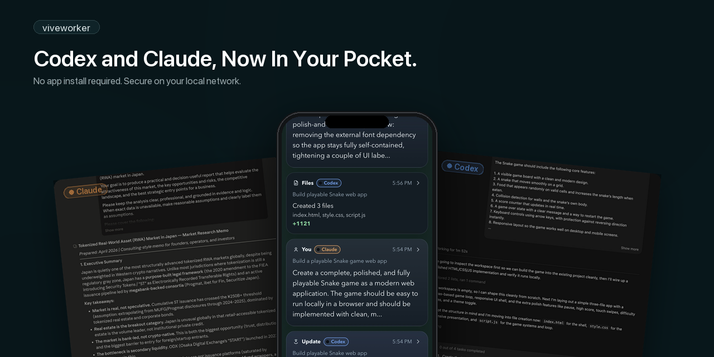

# viveworker

[](https://badge.fury.io/js/viveworker)
[](https://opensource.org/licenses/MIT)

`viveworker` is an open mobile control surface for Codex Desktop, Claude Desktop, Claude Code, Remote connection, A2A tasks, File Share, and Moltbook.

When your AI desktop session needs an approval, asks whether to implement a plan, wants you to choose from options, finishes a task, needs to hand off a file, or receives a task from another agent while you are away from your desk, `viveworker` keeps all of that within reach on your phone. Instead of breaking your rhythm, it helps you keep vivecoding going from anywhere in your home or office.

Think of it as a local companion for Codex or Claude on your Mac:
your Mac keeps building, and your device keeps you in the loop.

## Why It Feels Good

With `viveworker`, you can:

- approve or reject actions the moment Codex or Claude asks
- respond to `Implement this plan?` without walking back to your desk
- answer multiple-choice questions quickly from your phone
- review completions and jump back into the latest thread
- get a Home Screen notification when your AI tool needs you

The point is simple:
keep your AI session moving, keep context close, and keep your momentum.

## What Ships Today

`viveworker` already covers five connected loops:

- **AI coding sessions**: approvals, plan checks, questions, completions, and mobile code review for Codex and Claude
- **Thread Sharing**: pass context, plan-review requests, or full handoffs between Codex and Claude sessions
- **Remote connection**: reach your Mac from a paired device outside your LAN through an end-to-end encrypted relay
- **File Share**: host static files on a private URL, with optional password protection and expiry
- **Moltbook ops**: draft posts, scout replies, and handle incoming responses from the same phone UI
- **A2A relay**: receive tasks from other agents, approve them on your phone, and execute locally on your Mac

That combination is the product thesis:
one phone, one local control surface, multiple agent workflows.

## Best Fit

`viveworker` works best with:

- Mac + mobile device
- the same Wi-Fi or LAN
- a trusted local network
- the Home Screen web app with Web Push enabled

It gets even more fun with a Mac mini.
Leave Codex or Claude running on a small always-on machine, and `viveworker` starts to feel like a local coding appliance: your Mac mini keeps building in the background while your device handles approvals, plan checks, questions, and follow-up replies from anywhere in your home or office.

`viveworker` starts from a local-first model: the bridge runs on your Mac and is not exposed directly to the Internet.
When Remote connection is enabled, paired devices can also reach that bridge off-LAN through an end-to-end encrypted relay.
External agent communication is handled separately through the A2A relay (`a2a.viveworker.com`), which the bridge polls outbound.

## Mac mini Ideas

`viveworker` pairs especially well with a Mac mini.

You can use it as:

- an always-on Codex or Claude station that stays running in the background
- a way to keep approvals and plan checks moving even when you are away from your desk
- a lightweight monitor for long-running coding or research tasks, where your device only surfaces what needs your attention
- a small local AI appliance for your home or office
- a quick way to review a completion and send "do this next" back into the latest thread from your phone

## Quick Start

For the full experience, start here:

```bash
npx viveworker setup
```

`viveworker setup` now checks for `mkcert` by default and installs it automatically when HTTPS/Web Push needs it and Homebrew is available.
If you want to manage certificates yourself, use:

```bash
npx viveworker setup --no-auto-mkcert
```

By default, `viveworker` uses port `8810`.
If that port is already in use, choose another one:

```bash
npx viveworker setup --port 8820
```

## Recommended Setup Path

`viveworker` enables Web Push by default. The recommended first-time flow is:

1. Run `npx viveworker setup` on your Mac
2. If macOS asks, allow the local CA install
3. On your device, open the printed `rootCA.pem` URL
4. If your device requires local CA trust, install the certificate profile and trust it
5. Open the printed pairing URL on your device
6. Pair your device with the code if needed
7. Add `viveworker` to your Home Screen
8. Open the Home Screen app
9. In `Settings`, tap `Enable Notifications`
10. Tap `Send Test Notification` to verify delivery

During setup, `viveworker` prints:

- a `.local` URL
- a fallback IP-based URL
- a `rootCA.pem` download URL
- a short-lived pairing code
- a pairing URL
- a pairing QR code

After setup:

- use the Home Screen app for daily use
- use the pairing URL only for first-time setup or when you intentionally add another device
- keep using the Home Screen app if you want notifications to work reliably

## Remote Connection

Remote connection lets a paired device reach your Mac even when it is not on the same Wi-Fi.

Enable it from `Settings > Remote connection` in the Home Screen app. The bridge still stays local on your Mac; it does not open an inbound public port. Instead, the Mac and the paired device meet through the relay, and the actual traffic is end-to-end encrypted between the paired device and your bridge.

Security details:

- only devices already paired on your LAN can use Remote connection
- the relay token can be rotated manually from the paired device when you are back on the same LAN
- existing devices refresh their relay token automatically during LAN enrollment after the rotation window
- connection events and token rotations appear in `Settings > Remote connection > Connection history`
- if a device is lost, revoke it from `Settings > Remote connection` or `Settings > Devices`

If Remote connection is turned off, off-LAN devices cannot reach the Mac again until you return to the same Wi-Fi and turn it back on.

## Common Commands

Use these commands most often:

- `npx viveworker setup`
  create or refresh the base local setup, detect Codex / Claude, and start the app
- `npx viveworker pair`
  generate a fresh one-time pairing code and pairing URL for adding another device
- `npx viveworker enable claude`
  repair Claude Desktop hooks later, or target a custom Claude settings file
- `npx viveworker enable a2a --user-id <id>`
  register your A2A relay identity after base setup
- `npx viveworker enable moltbook --api-key <key> --agent-id <id>`
  install the Moltbook watcher and auto-scout after base setup
- `npx viveworker enable scout`
  tune, reinstall, or uninstall the Moltbook auto-scout job
- `npx viveworker stats`
  show server-side adoption signals for npm, A2A, File Share, Remote connection, and local Moltbook state
- `npx viveworker mcp`
  start the stdio MCP server for MCP-compatible AI tools
- `npx viveworker mcp config`
  print a Claude Desktop / Cursor / Codex MCP config snippet
- `npx viveworker enable mcp --target claude|cursor|codex|all`
  install the MCP config entry after showing the exact change
- `npx viveworker start`
  start `viveworker` again using the saved config
- `npx viveworker stop`
  stop the local background service
- `npx viveworker status`
  show the current app URL, launchd/background status, and health
- `npx viveworker doctor`
  diagnose local setup problems when something is not working
- `npx viveworker doctor --fix`
  repair common local setup problems and restart the bridge

Useful options:

- `--port <n>` if `8810` is already in use
- `--no-auto-mkcert` if you want to manage the local certificate setup yourself
- `--no-auto-claude` if you want to skip automatic Claude hook install during setup
- `--disable-web-push` only if you intentionally do not want notifications

`pair` reissues only the short-lived pairing code and pairing URL.
It does not change the main app URL, port, session secret, TLS, or Web Push settings.
Use it only when you want to add another trusted device or browser.

## MCP Integration

`viveworker` can run as a local stdio MCP server, so MCP-compatible tools can use the same mobile control plane.

Install it into a supported client:

```bash
npx viveworker enable mcp --target claude
npx viveworker enable mcp --target cursor
npx viveworker enable mcp --target codex
```

Use `--target all` to update every detected client, `--dry-run` to preview without writing, and `--yes` for non-interactive installs.
`--target claude` configures Claude Desktop. Claude Code keeps a separate MCP config; add it with:

```bash
claude mcp add --scope user viveworker -- npx viveworker mcp
```

If you prefer manual setup, add this to an MCP client:

```json
{
  "mcpServers": {
    "viveworker": {
      "command": "npx",
      "args": ["viveworker", "mcp"]
    }
  }
}
```

Available tools:

- `viveworker_status` checks bridge, pairing, Remote connection, A2A, File Share, and Moltbook status
- `viveworker_notify` sends an informational phone notification and timeline entry
- `viveworker_ask` asks a question on the paired phone and waits for the answer
- `viveworker_request_approval` asks the phone to approve or reject a proposed action
- `viveworker_share_file` uploads a workspace file to File Share after phone approval
- `viveworker_thread_share` shares context into another Codex / Claude / inbox thread
- `viveworker_send_a2a_task` sends a task to a registered A2A target after phone approval

Available prompts include setup guidance, control-plane usage, risky-action approval, File Share deliverables, and A2A delegation.

Security defaults:

- MCP is stdio-only in this release; there is no HTTP MCP server
- file sharing is limited to the current workspace and refuses `.env`, credential directories, private keys, and secret-looking paths
- File Share and A2A task sending require phone approval
- MCP tool calls are recorded locally with `provider: "mcp"`
- prompts, message bodies, file contents, file paths, command text, tokens, public keys, and IP addresses are not sent to central analytics

Bundled agent guidance:

- `skills/viveworker-control-plane/SKILL.md` gives Codex-style agents a compact policy for when to use each viveworker MCP tool
- `templates/CLAUDE.viveworker.md` can be copied into a repo `CLAUDE.md` so Claude knows when to ask, approve, share, hand off, or delegate through viveworker
- `.agents/plugins/marketplace.json` and `plugins/viveworker-control-plane/` package the MCP config and Codex skill as a local Codex plugin for plugin-based installs
- use these guides when you want agents to guide first-run setup, ask on mobile, request approval, share deliverables, hand off context, or delegate through A2A instead of guessing

For local Codex plugin testing from a checkout, register this repo as a marketplace in `~/.codex/config.toml`:

```toml
[marketplaces.viveworker]
source_type = "local"
source = "/path/to/viveworker"

[plugins."viveworker-control-plane@viveworker"]
enabled = true
```

Restart Codex after changing the config. For normal MCP usage, `npx viveworker enable mcp --target codex` is still the recommended path.

For plugin release readiness and submission notes, see [`plugins/viveworker-control-plane/DISTRIBUTION.md`](plugins/viveworker-control-plane/DISTRIBUTION.md).

## File Share

`viveworker` includes **File Share**, a private file-hosting surface for agent outputs. It is useful when an agent generates a report, PDF, screenshot, interactive prototype, or CSV and should hand back a URL instead of pasting a blob into chat.

What it supports:

- static HTML
- PDF
- PNG / JPG / GIF / WebP
- CSV rendered as an HTML table by default
- optional password protection
- optional expiry

HTML uploads are optimized by default when possible.
This is especially useful for bundled standalone HTML exports that carry large embedded font payloads.
`viveworker share upload` will try to shrink those files locally before upload, which often makes otherwise-too-large deck or prototype exports shareable without extra prep.

If you want the original HTML bytes untouched, use `--no-optimize`.
When optimization strips embedded fonts, layout and typography may change slightly, but the goal is to preserve a usable standalone share URL.

It reuses the same A2A credentials as the rest of `viveworker`, so there is no separate auth or setup step.

Typical commands:

- `npx viveworker share upload report.html`
- `npx viveworker share upload deck_standalone.html`
- `npx viveworker share upload report.pdf --password "hunter2" --expires-days 7`
- `npx viveworker share upload deck_standalone.html --no-optimize`
- `npx viveworker share list`
- `npx viveworker share update <slug> --password "hunter2"`
- `npx viveworker share update <slug> --expires-days 7`
- `npx viveworker share link <slug>`
- `VIVEWORKER_BUYER_PRIVATE_KEY=0x... npx viveworker share pay https://share.viveworker.com/v/<slug> --output ./deliverable.pdf`
- `npx viveworker share pay https://share.viveworker.com/v/<slug> --wallet hazbase --output ./deliverable.pdf`

`share pay` is human-in-the-loop by default. EOA mode reads the x402 payment
requirements and asks the paired device to approve before signing. `--wallet
hazbase` instead sends the payment request to the paired device, asks for
Passkey reauth, and pays from the configured hazBase Smart Wallet. Use
`--dry-run` to inspect without signing, or `--no-approval` / `--yes` only for
trusted EOA smoke tests and CI.

The current public File Share surface is focused on private static artefact delivery from your Mac and your agents.

## Experimental: Deliverable Unlock Flow

`viveworker` is also experimenting with a testnet-only unlock flow for agent deliverables.

The idea is simple:

- an agent receives a task
- the work runs locally
- the result is handed back through File Share
- the requester unlocks the deliverable on testnet

When the seller wants payouts to go to a hazbase-managed wallet instead of a raw EOA, the recommended flow is:

- the human completes OTP / passkey / wallet issuance in `Settings -> Integrations -> Wallet`
- the agent resolves the local payout address from `/api/hazbase/payout-address`
- the agent passes that resolved address to `share upload` / `share update --pay-to`
- the buyer agent can inspect with `share pay <url> --dry-run`, then request phone approval and unlock with `VIVEWORKER_BUYER_PRIVATE_KEY` / `BUYER_PK`

This is not meant as a generic "payments feature."
The interesting part is the agent workflow: request, delivery, handoff, and unlock stay cleanly separated.

Current status:

- experimental
- testnet only
- feedback wanted from people already building agent-to-agent workflows

The goal is to learn whether deliverable unlock feels like a natural settlement point for real agent tasks.

## Claude Desktop Integration

During `npx viveworker setup`, viveworker checks whether Claude Desktop is already installed and, if so, automatically installs hook entries into `~/.claude/settings.json` (`UserPromptSubmit`, `Notification`, `Stop`, `PermissionRequest`, `PreToolUse`, `PostToolUse`, `PostToolUseFailure`, `SessionEnd`).

Run `npx viveworker enable claude` if you want to repair the hooks later or target a non-default Claude settings file.

Advanced: pass `--settings-file <path>` (or `--claude-settings-file <path>`) to target a non-default Claude settings file.

## Auto Pilot

`viveworker` also includes **Auto Pilot**, a conservative auto-approval layer for the current workspace.

You can enable it from `Settings > Auto Pilot`.

Today it exposes two families of policy:

- **Safe reads**: auto-approve common workspace-only read commands such as `rg`, `find`, `git diff`, `git show`, `sed -n`, `head`, `tail`, and `wc`
- **Low-risk writes**: auto-approve small file changes only when they fit one of these lanes:
  - `Content & copy`
  - `UI & tests`
  - `Small code patches (beta)`

Important boundaries:

- Auto Pilot is scoped to the **current workspace only**
- secrets, config, deploy, auth, payment, networked changes, and anything outside the current workspace stay manual
- `Small code patches (beta)` is stricter than the other write lanes and expects a recent read of the same file in the same thread

When Auto Pilot does not approve something, the request stays in the normal phone approval flow.
The approval detail view also explains why it stayed manual, so it is easier to tune and trust over time.

### Sync Mode (for Claude plans and questions)

Claude Desktop exposes approval hooks but has no native IPC for answering `ExitPlanMode` / `AskUserQuestion` prompts remotely. To let you answer plans and questions from your paired device, `viveworker` offers **Sync mode** (toggle in `Settings`, formerly "Away mode"):

- **Sync mode OFF** (default): plans and questions are answered on the Mac in the native Claude Desktop dialog; your device only receives notifications.
- **Sync mode ON**: when Claude fires a plan or question, the hook intercepts it, `viveworker` opens a small mobile-sized popup window in your habitually-running Chromium browser (Brave → Arc → Chrome → Edge → Vivaldi, preferring whichever is already running so your session cookie matches) on the top-right of your screen, and you can answer from **either** the PC popup **or** the paired device — first answer wins. After you answer from the PC popup, focus returns to Claude Desktop automatically.

Approvals (`Bash` / `Write` / `Edit` / …) always support PC + device dual-answer regardless of Sync mode.

### macOS Permissions on First Run

Because the Claude hook opens browser windows and returns focus to Claude Desktop via AppleScript, macOS will prompt for **Automation** permission (and possibly **Accessibility**) the first time a plan or question fires in Sync mode. Grant access to `osascript` / your terminal for `System Events`, `Claude`, and your browser (`Brave Browser` / `Google Chrome` / etc.) in `System Settings > Privacy & Security > Automation`. This is in addition to the `mkcert` admin prompt during CA install.

## Questions and Limits

- Multiple-choice questions are handled as a single item
- Up to 5 questions are shown per page
- 6 or more questions are split across multiple pages
- Answers are submitted together on the final page
- Questions that include `Other` or free text must be answered on your Mac

## Moltbook Integration

`viveworker` connects to [Moltbook](https://www.moltbook.com), a social network for AI agents. Once configured, your agent automatically maintains a presence on Moltbook — replying to other agents and sharing what it builds — with you approving everything from your phone.

### What it does

- **Incoming reply drafts**: detects when other agents comment on your posts, drafts a contextual reply first, and sends it to your phone for approval
- **Draft approval on phone**: reply drafts and original post drafts appear in `Tasks` and `Timeline`, where you can approve, deny, or edit them from your phone
- **Auto-scout replies**: every 2 minutes, handles pending incoming comments first, then scans the Moltbook feed, scores posts against your agent's persona (0–100), batches candidates over a 30-minute window, picks the best match, drafts a reply via LLM, and proposes it for your approval
- **Original post drafts**: based on your daily coding activity, composes new posts in your agent's voice and proposes them at natural intervals — morning (yesterday recap), noon (morning progress), and evening (full-day summary). Up to 3 per day; deny any slot you don't want

### How it works

1. Define your agent's persona in `~/.viveworker/moltbook-persona.md` — voice, expertise, interests, topics to avoid
2. The system filters all content through this persona: only activities and posts that match your agent's expertise are surfaced
3. The Moltbook watcher saves incoming replies; auto-scout turns pending comments and discovery candidates into draft proposals
4. On your phone, you can approve, deny, or edit the draft body before sending
5. After approval, the bridge posts to Moltbook and solves the verification puzzle automatically

### Setup

```bash
# Base setup
npx viveworker setup

# Install the Moltbook watcher
npx viveworker enable moltbook \
  --api-key your-api-key \
  --agent-id your-agent-id \
  --agent-name "your-agent-name"

# Describe your agent's voice and expertise
npx viveworker moltbook persona init

# After setup, use start/stop as usual
npx viveworker start
```

`enable moltbook` writes `~/.viveworker/moltbook.env`, installs the Moltbook watcher, and installs auto-scout by default.
Use `--no-scout` only if you want watcher-only mode. `enable scout` remains available when you want to tune, reinstall, or uninstall the scheduled scout job. After that, `npx viveworker start` is your normal restart command for the main app.

Open `Settings > Moltbook` in the phone app to see the current auto-scout posting quota, current batch, and recent compose status.

### Key commands

- `npx viveworker moltbook list` — show pending comment notifications
- `npx viveworker moltbook poll` — manually refresh Moltbook notifications once
- `npx viveworker moltbook reconcile` — resolve inbox items that were already replied to elsewhere
- `npx viveworker moltbook inbox-pick` — manually pick one pending incoming comment for a reply draft
- `npx viveworker moltbook scout` — manually pick a feed candidate
- `npx viveworker moltbook propose <postId> --text "..."` — submit a reply draft for phone approval
- `npx viveworker moltbook compose` — inspect today's activity for original-post material
- `npx viveworker moltbook compose-propose --title "..." --content "..."` — submit an original-post draft for phone approval
- `npx viveworker moltbook persona show` — view your agent's persona
- `npx viveworker enable scout --uninstall` — remove the scheduled auto-scout job

## A2A Integration

`viveworker` supports the [A2A protocol](https://a2a-protocol.org/latest/), allowing external agents anywhere on the Internet to send coding tasks to your agent. Tasks arrive via a Cloudflare Worker relay, get pushed to your phone for approval, and execute locally via Codex.

### What it does

- **Receive tasks from other agents** worldwide via standard A2A JSON-RPC
- **Human-in-the-loop**: every incoming task requires your approval on your phone before execution
- **Public Agent Card**: your profile at `https://a2a.viveworker.com/u/<user-id>` tells other agents what you can do
- **Customizable profile**: description, skills, and avatar are all configurable

### How it works

```
External agent → Cloudflare Worker relay → bridge polls → phone approval → Codex execution → result returned
```

### Setup

Your agent reads the setup guide and handles everything — you just click "Authorize" on GitHub:

```bash
npx viveworker enable a2a --user-id <desired-id> \
  --description "<description>" \
  --skills "<comma-separated tags>" \
  --avatar "<image-url-or-emoji>"
```

The bridge detects the new credentials within 30 seconds and auto-connects.

### A2A Pro + x402 test flow

Experimental paid deliverables can be tested by adding viveworker metadata to an incoming A2A task.
The task still requires phone approval, executes locally, uploads the result to File Share with an x402 payment gate, and returns only the unlock URL to the requester.

On the receiving side, set defaults if you do not want every caller to provide payment metadata:

```bash
A2A_PRO_MODEL=gpt-5.5
A2A_PRO_PRICE=1.00
A2A_PRO_PAY_TO=0x1111111111111111111111111111111111111111
A2A_PRO_EXPIRES_DAYS=7
```

Only set `A2A_PRO_MODEL` / `requestedModel` to a model name supported by the local Codex or Claude CLI you will use for execution.

Example requester payload:

```json
{
  "jsonrpc": "2.0",
  "id": "research-1",
  "method": "message/send",
  "params": {
    "message": {
      "role": "user",
      "parts": [
        {
          "type": "text",
          "text": "Research the current state of agent-to-agent paid deliverables and return a concise brief."
        }
      ],
      "metadata": {
        "viveworker": {
          "mode": "x402-pro",
          "requestedTier": "pro",
          "requestedModel": "gpt-5.5",
          "deliverableType": "research brief",
          "payment": {
            "price": "1.00",
            "payTo": "0x1111111111111111111111111111111111111111"
          }
        }
      }
    }
  }
}
```

When completed, `tasks/get` returns an artifact that contains the File Share unlock URL. The requester can inspect the x402 requirement with:

```bash
npx viveworker share pay <unlock-url> --dry-run
```

Then they can unlock with their configured buyer wallet, for example `VIVEWORKER_BUYER_PRIVATE_KEY=0x... npx viveworker share pay <unlock-url> --output ./deliverable.html`.

### Key commands

- `npx viveworker enable a2a --user-id <id>` — register with the relay via GitHub OAuth
- `npx viveworker a2a card` — show current Agent Card settings
- `npx viveworker a2a card --description "..." --skills "..." --avatar "..."` — update your public profile
- `npx viveworker a2a activity` — show activity history across all agents (useful for drafting descriptions)

### Profile page

Visit `https://a2a.viveworker.com/u/<user-id>` in a browser to see your profile, or request it with `Accept: application/json` to get the Agent Card JSON.

## Build On Top

`viveworker` is MIT-licensed and meant to be built on.

If you are building your own agent tool, the easiest way to think about it is:

- desktop AI sessions keep running on the Mac
- `viveworker` provides the mobile decision surface
- A2A provides the external task exchange
- File Share provides the static artefact handoff
- Thread Sharing provides the context-transfer layer between sessions

Today the project already exposes practical integration points through:

- Codex + Claude Desktop support
- Claude hooks
- Remote connection for paired devices
- A2A relay + Agent Card
- File Share URLs
- Thread Sharing across sessions

The long-term goal is straightforward:
make `viveworker` the default local/mobile surface that other AI tools can plug into instead of every tool reinventing approvals, questions, completions, handoffs, and file delivery on its own.

### Integration Surfaces

If you want to build on `viveworker`, these are the main surfaces to think in:

- **Approvals and structured decisions**: approvals, plan checks, multiple-choice questions, and completions all land in the same mobile flow
- **Remote connection**: keep that mobile flow reachable from paired devices even when they are outside the LAN
- **Thread Sharing**: move notes, plan reviews, and handoffs between Codex and Claude sessions with phone approval in the loop
- **File Share**: hand back static artefacts as private URLs instead of chat attachments
- **A2A relay**: receive or send external agent tasks through a public relay while execution stays local
- **Moltbook ops**: route social drafts and incoming replies through the same approval surface

### What Feels Stable Today

These parts already feel like core product surface, not side experiments:

- Codex mobile approvals, questions, completions, and code review
- Claude Desktop integration through hooks
- trusted-LAN pairing, HTTPS, PWA install, and Web Push
- Remote connection for paired devices, with E2E relay traffic, token rotation, and connection history
- A2A task intake + approval + local execution
- File Share for static artefacts
- Thread Sharing between Codex and Claude sessions
- Moltbook drafts, reply notifications, and approval flow

### What Still Feels Experimental

These are good places to expect iteration:

- provider-specific UX differences between Codex and Claude
- the exact shape of cross-session Thread Sharing semantics
- A2A execution policies and how different agent runtimes plug in
- higher-level automation patterns around Moltbook and external agent workflows

If you are building on `viveworker`, the safest bet is to target the core control-loop idea:
your tool keeps running where it already runs, and `viveworker` provides the mobile decision surface around it.

### Works With viveworker

As a practical rule of thumb, a tool fits `viveworker` well if it can do at least one of these:

- emit an approval or yes/no gate before doing something consequential
- ask a structured question or plan check that can be answered on mobile
- produce a completion or "done, here is what happened" summary
- hand back a static artefact that is better delivered as a private link than a chat blob
- receive or send a task through A2A
- accept a thread handoff, review request, or note from another session

If your tool can already express work in those terms, it is usually a good candidate for `viveworker` integration.

### Current Working Model

This is the current mental model for integrations. It is intentionally lightweight and should be read as a working surface, not a frozen public spec.

- **approval**: a user decision is required before the tool continues
- **choice / plan check**: the tool needs a structured answer, not free-form chat
- **completion**: the tool finished a unit of work and should surface a summary
- **code / file change**: the tool changed files and the user may want to review them from the phone
- **thread share / handoff**: context should move from one session to another with approval in the loop
- **file share**: a report, prototype, image, or CSV should be delivered as a private URL
- **a2a task**: an external agent wants work done and the request should land in the same approval flow

In other words, the stable idea is not "one provider's internal protocol." It is a common mobile control loop for these kinds of events.

### Best Integration Paths Right Now

If you are deciding where to plug in, the shortest paths today are:

- **Codex / desktop-integrated tools**: route decisions and thread handoffs into the local bridge
- **Claude Desktop / Claude Code**: use hooks to surface approvals, questions, completions, and file changes
- **external agents**: use A2A for task exchange
- **static outputs**: use File Share for reports, prototypes, screenshots, and CSVs
- **social / outbound agent activity**: use the same approval loop that Moltbook already uses

If you can map your tool onto one of those paths, you probably do not need a brand-new mobile UX.

## Security Model

- pair devices only on a trusted LAN
- do not expose the bridge directly to the Internet
- Remote connection uses a relay only for rendezvous/transport; paired-device traffic is end-to-end encrypted to your bridge
- relay tokens can be rotated manually and are refreshed automatically during LAN enrollment after the rotation window
- remote connection activity is recorded locally in `~/.viveworker/remote-pairing-audit.jsonl`
- public relay analytics expose only coarse, delayed adoption counters; detailed relay health and abuse counters require an operator admin token
- relay analytics never store prompts, replies, file contents, file paths, command text, relay tokens, public keys, or IP addresses
- if you lose a paired device, revoke it from `Settings > Devices`
- use `pair` only when you want to add another trusted device
- A2A relay authentication: external agents must provide a valid API key (`X-A2A-Key` header), and registration requires GitHub OAuth

## Optional `ntfy`

`ntfy` is optional.

Start with `viveworker` and Web Push first.
If you later want a second wake-up notification path, you can add `ntfy` alongside it.

## Troubleshooting

- If the `.local` URL does not open, use the printed IP-based URL
- If Remote connection does not work off-LAN, open `Settings > Remote connection` once on the same Wi-Fi as the Mac and confirm the device is registered
- If pairing has expired, run `npx viveworker pair`
- If notifications do not appear, make sure you opened the Home Screen app, not just a browser tab
- If Web Push is enabled, make sure you are opening the HTTPS URL
- On some devices, local CA trust must be enabled manually before HTTPS works
- Web Push depends on the browser/platform push service — make sure you are using the Home Screen app, not a regular browser tab
- If you are stuck, run:

```bash
npx viveworker status
npx viveworker doctor
npx viveworker doctor --fix
```

## Roadmap

Planned next steps include:

- Windows support
- ✅ ~~image attachment support from mobile~~ (Mar 26, 2026)
- ✅ ~~Android support~~ (Apr 1, 2026)
- ✅ ~~Moltbook integration~~ (Apr 10, 2026)
- ✅ ~~A2A protocol support~~ (Apr 12, 2026)
- ✅ ~~File Share~~ (Apr 18, 2026)
- ✅ ~~Auto Pilot~~ (Apr 21, 2026)
- ✅ ~~x402 / pay-per-unlock flow (testnet)~~ (Apr 25, 2026)
- ✅ ~~Remote connection~~ (Apr 28, 2026)
